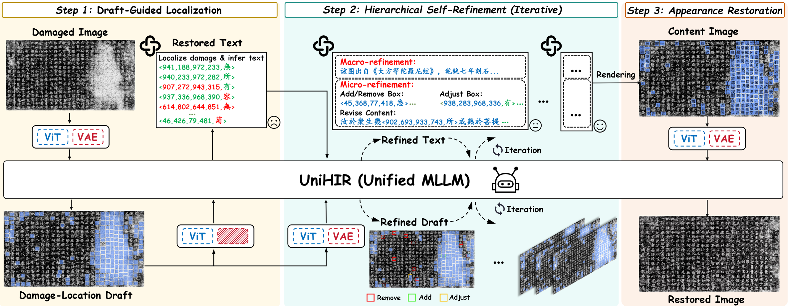
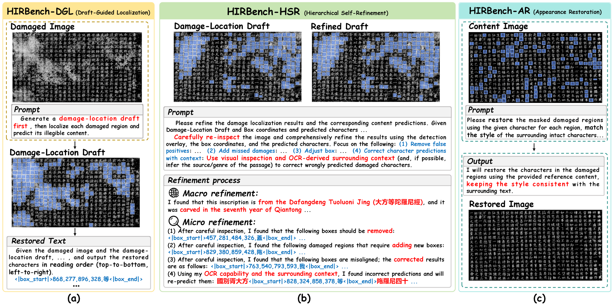
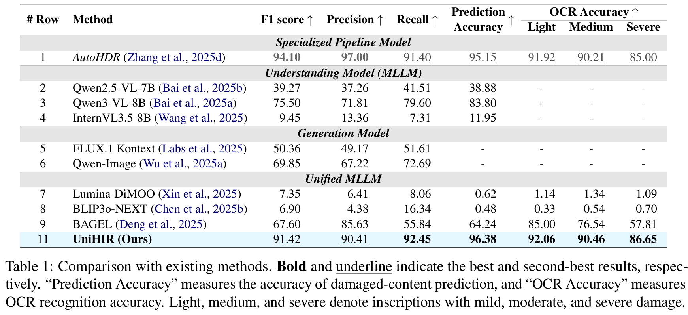
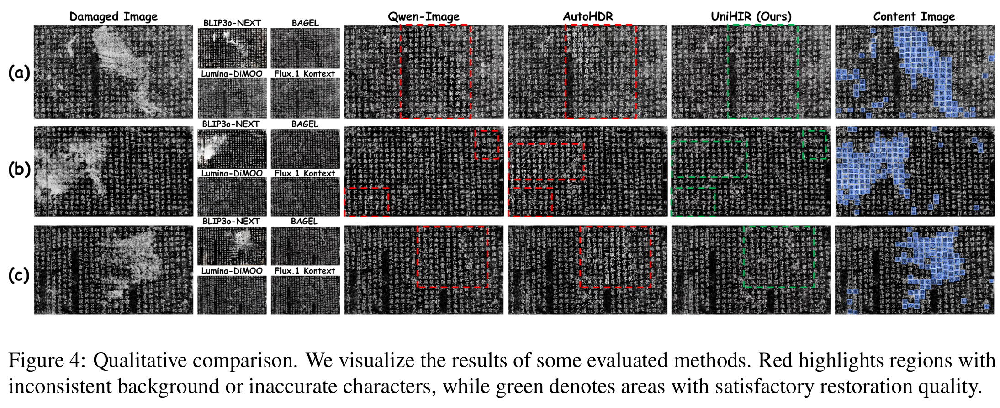

<div align=center>

# [ACL 2026 main] Draft, Verify, Restore: Self-Refining Historical Inscription Restoration with a Unified MLLM

</div>

## Important Note
The original data of the dataset is sourced from public channels such as the Internet, and its copyright shall remain with the original providers. The collated and annotated dataset presented in this case is for non-commercial use only and is currently licensed to universities and research institutions. To apply for the use of this dataset, please fill in the corresponding application form in accordance with the requirements specified on the dataset’s official website. The applicant must be a full-time employee of a university or research institute and is required to sign the application form. For the convenience of review, it is recommended to affix an official seal (a seal of a secondary-level department is acceptable).

## 🌟 Highlights
- **UniHIR**

- **HIRBench**


- We propose **UniHIR**, a pioneering Unified MLLM for end-to-end HIR, offering a new perspective on HIR.
- UniHIR incorporates two novel designs, Draft-Guided Localization and Hierarchical Self-Refinement, to support iterative reasoning and self-correction for HIR.
- We propose UHIRFactory and construct **HIRBench** to enable step-wise, memory efficient training of UniHIR.
- Extensive experiments demonstrate that our method achieves superior restored-text accuracy and generation quality.

## 📏 Evaluation Result


## 🌄 Visualization


## 📅 News
- **2026.4.05**: 🎉🎉 Our [paper](https://aclanthology.org/2026.acl-long.1254/) is accepted by ACL Main.


## 🚧 TODO List

- [ ] Release inference code
- [ ] Release pretrained model
- [ ] Release dataset

## 💙 Acknowledgement
- [BAGEL](https://github.com/bytedance-seed/BAGEL)
- [AutoHDR](https://github.com/QwenLM/Qwen3)
- [DiffHDR](https://github.com/yeungchenwa/HDR)
- [HisDoc1B](https://github.com/SCUT-DLVCLab/HisDoc1B)
- [MegaHan97K](https://github.com/SCUT-DLVCLab/MegaHan97K)


## 📜 License
The code and dataset should be used and distributed under [(CC BY-NC-ND 4.0)](https://creativecommons.org/licenses/by-nc-nd/4.0/) for non-commercial research purposes.

## ⛔️ Copyright
- This repository can only be used for non-commercial research purposes.
- For commercial use, please contact Prof. Lianwen Jin (eelwjin@scut.edu.cn).
- Copyright 2026, [Deep Learning and Vision Computing Lab (DLVC-Lab)](http://www.dlvc-lab.net), South China University of Technology. 

## ✒️Citation
If you find PosterVerse helpful, please consider giving this repo a ⭐ and citing:
```latex
@article{zhang2026unihir,
      title={Draft, Verify, Restore: Self-Refining Historical Inscription Restoration with a Unified MLLM}, 
      author={Yuyi Zhang, Junle Liu, Peirong Zhang, Jianliang Liu, Zhenhua Yang, Lianwen Jin},
      journal={Proceedings of the 64th Annual Meeting of the Association for Computational Linguistics},
      year={2026},
}
```
Thanks for your support!

## ⭐ Star Rising
[](https://star-history.com/#ZZXF11/UniHIR&Timeline)
