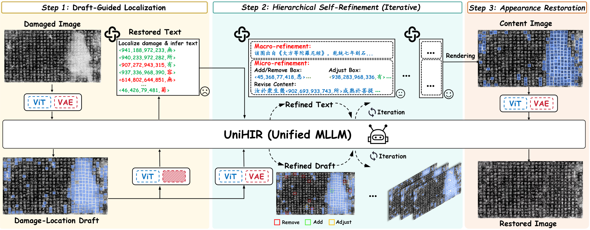
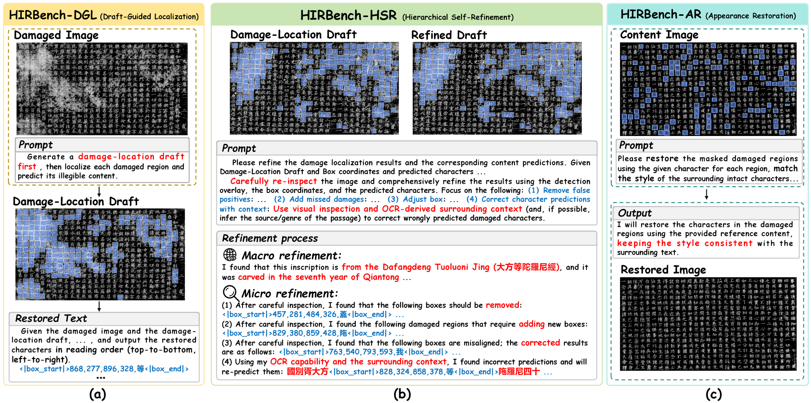
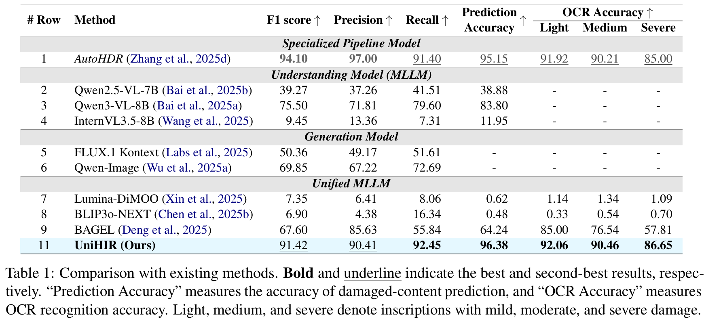
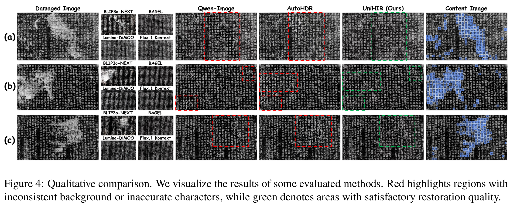

<div align="center">

# UniHIR

### Draft, Verify, Restore：基于统一多模态大模型的自迭代历史铭文修复

[**English**](README.md) | [**简体中文**](README_CN.md)

[](https://aclanthology.org/2026.acl-long.1254/)
[](https://aclanthology.org/2026.acl-long.1254/)
[](https://www.modelscope.cn/models/zzxfzyy/UniHIR)
[](https://www.python.org/)
[](https://creativecommons.org/licenses/by-nc-nd/4.0/)

**张宇一<sup>&#42;</sup> · 刘俊乐<sup>&#42;</sup> · 张培荣<sup>&#42;</sup> · 刘建良 · 杨振华 · 金连文<sup>†</sup>**

华南理工大学 · 深度学习与视觉计算实验室

<sup>&#42;</sup> 共同一作 &nbsp;&nbsp; <sup>†</sup> 通讯作者

</div>

> **UniHIR 是首个面向端到端历史铭文修复的统一多模态大模型。** 它在同一框架中依次完成损伤位置与缺失内容草拟、自校验与迭代优化，以及整页外观修复。

## 🔥 最新动态

- **2026-07-05** — 论文发表于 **ACL 2026 Main**。[[论文页面](https://aclanthology.org/2026.acl-long.1254/)] [[PDF](https://aclanthology.org/2026.acl-long.1254.pdf)]
- **2026-07-05** — 推理代码与 UniHIR 预训练模型正式发布。

## ✨ 方法概览

<p align="center"></p>

UniHIR 将传统的任务分离式流水线统一为一个模型，并完成三个相互衔接的阶段：

1. **草稿引导定位（Draft-Guided Localization）**：联合定位损伤区域并预测难以辨认的文字。
2. **层级自迭代（Hierarchical Self-Refinement）**：从宏观和微观两个层面反复修正漏检、误检、位置偏差与语义不一致结果。
3. **外观修复（Appearance Restoration）**：将优化后的内容重新渲染到文档中，并保持整页字体和风格一致。

### 核心贡献

- 提出面向端到端历史铭文修复的统一多模态大模型框架。
- 设计草稿引导定位与层级自迭代机制，实现迭代理解与自我校正。
- 提出 **UHIRFactory**，支持高分辨率输入和长序列条件下的分阶段显存高效指令微调。
- 构建覆盖损伤定位、层级优化与外观修复的 **HIRBench**。
- 在文字修复准确率和视觉质量上取得优异表现，同时保持整页一致性。

## 📦 项目资源

| 资源 | 链接 | 状态 |
|---|---|---|
| 论文 | [ACL Anthology](https://aclanthology.org/2026.acl-long.1254/) · [PDF](https://aclanthology.org/2026.acl-long.1254.pdf) | 已发布 |
| UniHIR 预训练模型 | [ModelScope](https://www.modelscope.cn/models/zzxfzyy/UniHIR) | 已发布 |
| 推理代码 | [本仓库](https://github.com/ZZXF11/UniHIR) | 已发布 |
| HIRBench | [申请入口](http://121.41.49.212:9000/) | 发布中 |

## 🚀 快速开始

### 1. 克隆仓库并创建环境

```bash
git clone https://github.com/ZZXF11/UniHIR.git
cd UniHIR
conda create -n unihir python=3.10 -y
conda activate unihir
pip install -r requirements.txt
```

### 2. 下载预训练模型

从 [ModelScope](https://www.modelscope.cn/models/zzxfzyy/UniHIR) 下载模型权重，将模型目录放在 `./UniHIR`，或通过 `--model_path` 指定实际路径。

### 3. 执行推理

```bash
CUDA_VISIBLE_DEVICES=0 python infer.py \
  --img_path examples/FS_12_159_2.jpg \
  --ref_count 6 \
  --save_path ./results \
  --model_path ./UniHIR
```

命令会在 `./results` 中生成修复结果图，以及包含中间步骤和合并后修复预测的文本文件。

> [!NOTE]
> 推荐使用具有 **80 GB 显存**的 NVIDIA A100 级别 GPU。实际显存需求会随图像分辨率和自迭代次数变化。

### 参数说明

| 参数 | 默认值 | 说明 |
|---|---:|---|
| `--img_path` | `examples/FS_12_159_2.jpg` | 待修复的历史铭文图像路径 |
| `--ref_count` | `6` | 层级自迭代次数 |
| `--save_path` | `./results` | 修复图像和文本预测保存目录 |
| `--model_path` | `./UniHIR` | UniHIR 预训练模型本地路径 |

## 🧩 HIRBench

<p align="center"></p>

| 子集 | 任务 | 发布状态 |
|---|---|---|
| HIRBench-DGL | 草稿引导定位 | 即将发布 |
| HIRBench-HSR | 层级自迭代 | 即将发布 |
| HIRBench-AR | 外观修复 | 即将发布 |

HIRBench 仅限非商业科研使用。高校和科研机构的申请人可通过[在线申请入口](http://121.41.49.212:9000/)提交申请。审核通过后将获得数据压缩密码，使用者须遵守全部数据使用条款。

## 📊 实验结果

### 定量比较

<p align="center"></p>

### 定性比较

<p align="center"></p>

## 🗺️ 开源计划

- [x] 发布推理代码
- [x] 发布 UniHIR 预训练模型
- [ ] 发布 HIRBench
- [ ] 补充低显存推理建议

## ⚖️ 数据申请与负责任使用

数据集原始材料来自互联网等公开渠道，其版权归原始提供者所有。本项目整理和标注的数据仅限非商业科研用途，目前仅授权高校与科研机构使用。

申请人须为高校或科研机构全职工作人员，并提交本人签署的申请表。为方便审核，建议加盖单位公章，二级单位公章亦可。

## 💙 致谢

[BAGEL](https://github.com/bytedance-seed/BAGEL) · [AutoHDR](https://github.com/SCUT-DLVCLab/AutoHDR) · [DiffHDR](https://github.com/yeungchenwa/HDR) · [HisDoc1B](https://github.com/SCUT-DLVCLab/HisDoc1B) · [MegaHan97K](https://github.com/SCUT-DLVCLab/MegaHan97K)

## 📜 许可与版权

代码与数据以 [CC BY-NC-ND 4.0](https://creativecommons.org/licenses/by-nc-nd/4.0/) 许可提供，仅限非商业科研使用。商业使用请联系金连文教授：`eelwjin@scut.edu.cn`。

版权所有 © 2026 华南理工大学[深度学习与视觉计算实验室](http://www.dlvc-lab.net)。

## ✒️ 引用

```bibtex
@inproceedings{zhang-etal-2026-draft,
  title     = {Draft, Verify, Restore: Self-Refining Historical Inscription Restoration with a Unified MLLM},
  author    = {Zhang, Yuyi and Liu, Junle and Zhang, Peirong and Liu, Jianliang and Yang, Zhenhua and Jin, Lianwen},
  booktitle = {Proceedings of the 64th Annual Meeting of the Association for Computational Linguistics (Volume 1: Long Papers)},
  month     = jul,
  year      = {2026},
  address   = {San Diego, California, United States},
  publisher = {Association for Computational Linguistics},
  url       = {https://aclanthology.org/2026.acl-long.1254/},
  doi       = {10.18653/v1/2026.acl-long.1254},
  pages     = {27216--27231}
}
```

## ⭐ Star History

[](https://star-history.com/#ZZXF11/UniHIR&Timeline)
